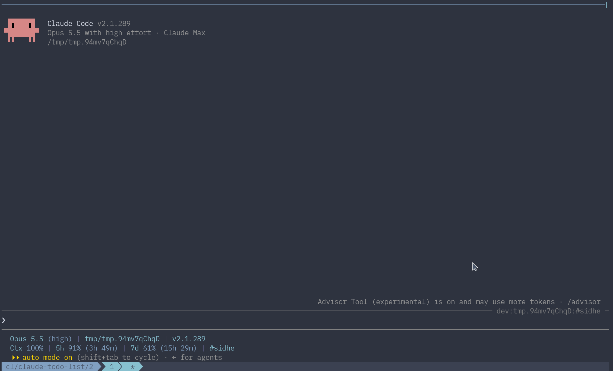

# Claude Todo List

[](https://github.com/cldotdev/claude-todo-list/actions/workflows/ci.yml)

[English](README.md) | 繁體中文

一個 [Claude Code](https://code.claude.com) mod，會持續整理對話中尚未處理的事項，並顯示在 prompt 上方的 band。

對話一長，還沒做的決定、答應過的後續工作和沒回答的問題就會被埋在很前面，很容易漏掉。這個 mod 會隨著對話進行把它們收集起來，在處理完之前一直留在眼前。



## 運作方式

- 每次主迴圈的 turn 以回答結束後，mod 會把這個 turn 送給 Sonnet (用的是 `sonnet` alias，實際模型跟著安裝的 Claude Code 版本走)，問它這個 turn 解決了清單上的哪些事項、又多出哪些新的事項。Subagent 的 turn 不算在內。
- 待辦事項指的是有人說要延後的工作、agent 答應要做的後續工作或檢查，以及還沒有結論的問題或決定。正在執行的這一步、同一個 turn 內就完成的事，以及已經列在 OpenSpec `tasks.md` 裡的任務，都不會列入。
- 每個事項有一行標題和一段簡短說明，語言跟 agent 回答時用的語言相同。
- 清單按 session 分開保存，恢復 session 時會一起還原。清單超過 `cleanupPeriodDays` 設定的天數沒更新就會被刪除，這個設定也決定 Claude Code 保留 transcript 的天數，預設 30 天。`/clear` 會清空清單。
- 刪除過的事項會被記住，模型不會再把它加回來。

每個有回答的 turn 會多一次 Sonnet 呼叫。`/todos refresh` 會 fork 主對話，所以是用主模型帶著完整 context 執行。

## 需求

支援 mod 的 Claude Code (>= 2.1.290)。

## 安裝

從這個 repo 的 marketplace 安裝：

```bash
claude plugin marketplace add cldotdev/claude-todo-list
claude plugin install todo-list@claude-todo-list
```

## 使用方式

### `/todos` 指令

| 指令 | 作用 |
| --- | --- |
| `/todos` | 列出待辦事項和說明 |
| `/todos refresh` | 根據整段對話重建清單 |
| `/todos clear` | 清空清單 |
| `/todos delete <編號>` | 依編號刪除事項，例如 `2`、`1-3` 或 `1,4 6`。只要有一個編號超出清單範圍，整次刪除就會取消 |
| `/todos <prompt>` | 把所有事項加上編號、以引用的形式放在 prompt 前面一起送出，prompt 裡就能寫「做 1 和 2，跳過 3」這類指示 |

### Band

清單有事項時，prompt 上方的 band 會顯示加上編號的清單。

| 按鍵 | 動作 |
| --- | --- |
| `Ctrl+X Tab` | 把焦點移到 band |
| `j`/`k`、`Tab`/`Shift+Tab` | 移到下一個或上一個事項 |
| `s` | 選取或取消選取焦點所在的事項 |
| `a` | 選取所有事項，所有事項都已選取時則清除選取 |
| `p` | 把已選取的事項貼到 prompt 輸入框，沒有選取時貼焦點所在的事項，每項都附上它在 band 裡的編號 |
| `o`/`Enter` | 顯示焦點所在事項的說明，或回到清單 |
| `b` | 用 `/btw` 詢問焦點所在的事項，Claude 正在工作時會等目前這一輪結束才回答 |
| `d` | 刪除焦點所在的事項，要再按一次 `d` 確認，按 `Esc` 取消 |
| `Esc` | 回到 prompt，band 正在顯示事項說明時會切回清單 |

## 開發

| 路徑 | 內容 |
| --- | --- |
| `hooks/register.tsx` | 事件 hook、`/todos` 指令和 band |
| `hooks/list.ts` | 給模型的 prompt 和回覆解析 |
| `types/index.d.ts` | mod 的 state 型別定義 |
| `tests/` | 由 `claude plugin test` 執行的測試 |

```bash
claude plugin validate .
claude plugin test .
```

要試用本機的修改，啟動 Claude Code 時載入 clone，只對這個 session 有效：

```bash
claude --plugin-dir /path/to/claude-todo-list
```

在這個 session 裡，clone 會取代已安裝的 `todo-list@claude-todo-list`，不需要先停用或解除安裝。

## 授權

[MIT](LICENSE)
